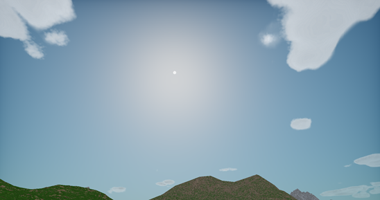
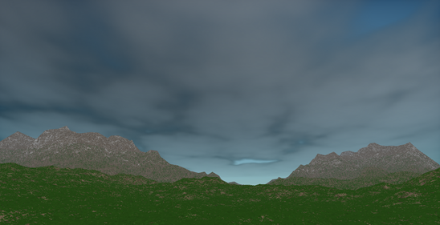
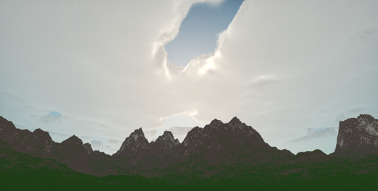
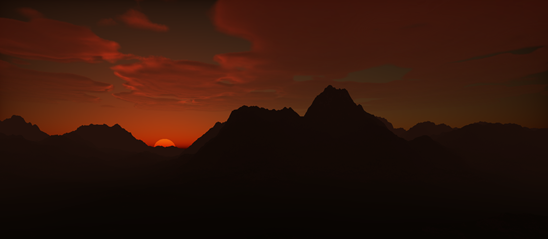

# ProceduralCloudscapes

Using the C++ programming language and the OpenGL communication specification for the graphics card, a rendering system was developed in which a real-time rendering of the volumetric clouds algorithm was implemented. The cloud shape model is based on a combination of various noise functions, while the cloud illumination model is inspired by the physical behavior of clouds. The basic algorithm for rendering the volumetric shape relies on the ray-marching algorithm. In addition to rendering clouds, the system also implements the rendering of the atmosphere and landscape – as essential components in creating a realistic virtual scene. The system’s primary purpose is to provide a highly configurable, yet realistic solution for rendering volumetric clouds in real-time.

## Showcase

## Purpose

Master's thesis at University of Zagreb, Faculty of Electrical Engineering and Computing
